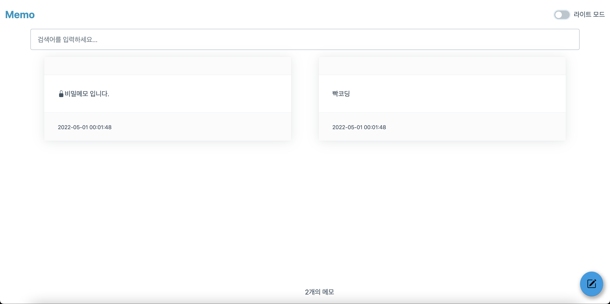
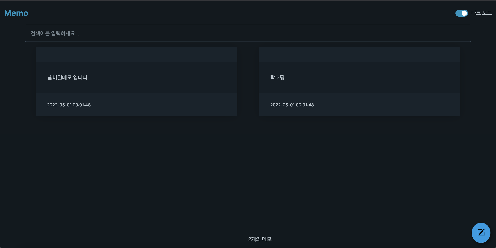
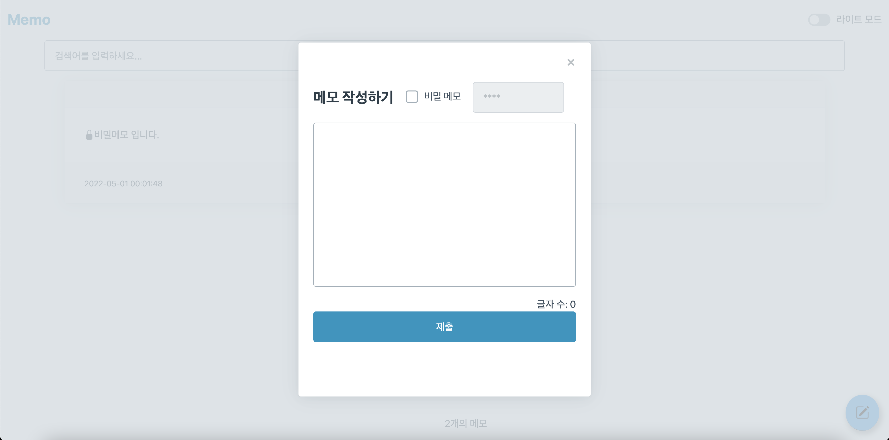
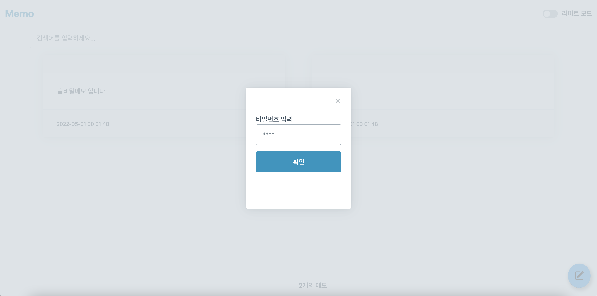
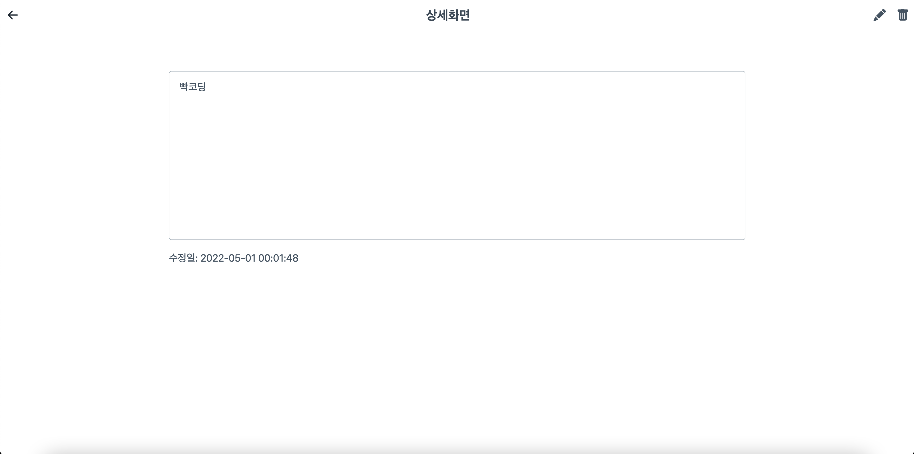
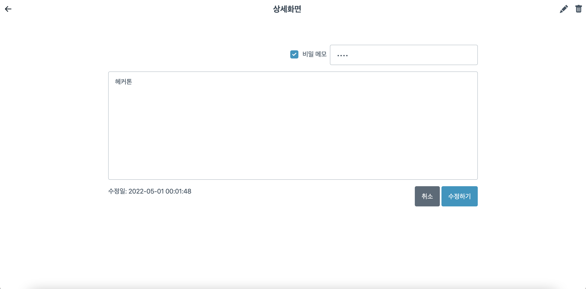
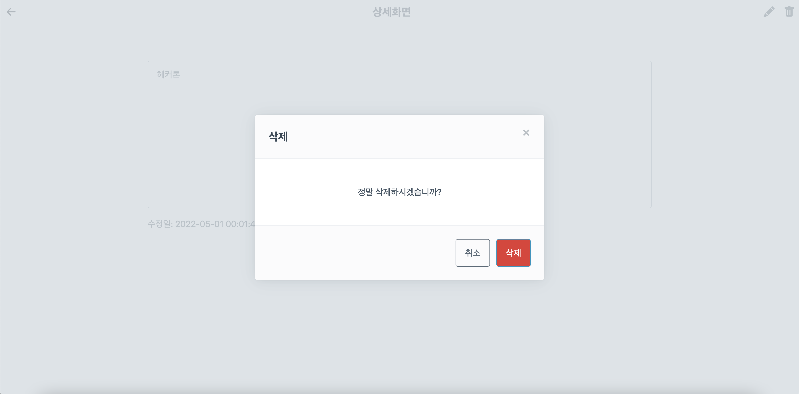

    </a>&nbsp 
    </a>&nbsp 
    </a>&nbsp
     
    <a href="http://rememo.kro.kr:5001/">REMEMO</a> 바로가기

* * *
### 유튜버 [개발하는 정대리](https://www.youtube.com/c/%EA%B0%9C%EB%B0%9C%ED%95%98%EB%8A%94%EC%A0%95%EB%8C%80%EB%A6%AC)님이 주관한  `[제 1회 빡코딩콘]` 참가
* * *
화면구성:
- 메모 목록화면
- 메모 상세화면
- 메모 편집, 작성 화면 

⭐️기능:
- 사용자는 작성한 메모 목록을 볼 수 있어야함 
- 메모 목록에 노출되는 메모는 작성된 메모문장 한줄만 노출된다.
- 메모 작성 페이지에서 메모 작성이 가능하다.
- 메모를 작성할때 작성된 메모의 글자수가 노출된다.
- 사용자는 메모를 검색할 수 있어야 한다.
- 사용자는 메모를 편집할 수 있어야 한다.
- 사용자는 메모를 삭제할 수 있어야 한다.
- 작성된 메모는 비밀메모로 변경이 가능하다.

비밀메모: 
- 메모목록에 메모 문장이 노출되지 않는다.
- 메모 목록 화면에는 “비밀메모 입니다” 혹은 잠금 표시로 노출된다.
- 메모 목록에서 상세보기클릭시 비밀메모인 경우 암호를 입력해야 메모 상세 화면으로 이동이 가능하다.
- 일반메모는 메모 상세화면에서 비밀메모로 변환이 가능하다.
- 일반메모에서 비밀메모로 설정시 비밀번호 입력창이 뜨고 비밀번호를 입력하면 비밀메모로 바뀐다.
* * *
- ### 기술 스텍
    - HTML, CSS, JS
    - Python
- ### 외부 라이브러리
    - Flask
    - Sqlite
    - Jquery
    - Pico css
    - BootStrap Icon

* * *
|이름|이미지|
|--|--|
|메인 페이지 (라이트)||
|메인 페이지 (다크)||
|메모 작성||
|잠긴 메모||
|상세 화면||
|수정||
|삭제||
